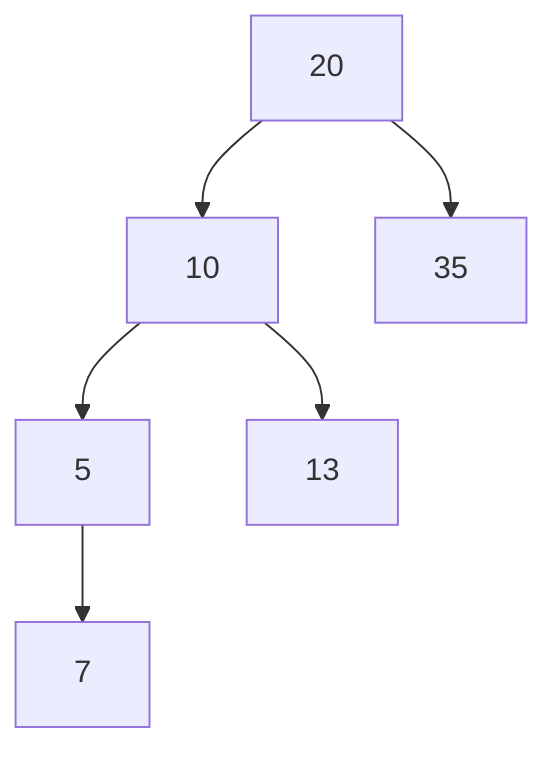

# Learning Binary Tree

## Method of My Madness:
1. Learning how to build a tree
2. Learning how to searh a tree
3. Learning how to add nodes
4. Learning how to delete a node
5. Learning how to optimize the tree
6. Learning how to add a node optimally
7. Learning how to remove a node optimally (including root)
8. Learning how to change the root node

Current Tree for these learning steps

## Method to calculate all the possible permutations of said tree

This equation originally stumped me.
Trying to figure out what it broke out to took a lot of research and a couple youtube videos 

1. $p$ = Permutations
2. $n_t$ = Total Number of Nodes
3. $n$ = Nodes (Before i knew it was all nodes)

$\huge p = \dfrac{^{2n}{C_n}}{{n_t+1}}$

I eventually figured out that the equation above equals the one below.

$\huge \dfrac{^{2n}{C_n}}{{n_t+1}} = \dfrac{{(2n_t)}!}{{(n+1)}!{(n_t)}!}$